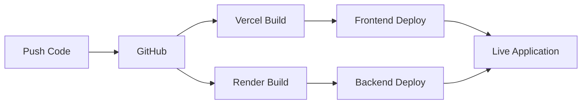

# 🚀 Deployment Guide

This guide covers deploying both the frontend and backend of the Web3 Message Signer & Verifier application.

## 📱 Frontend Deployment (Vercel)

### Quick Deploy Button

[](https://vercel.com/new/clone?repository-url=https://github.com/DM-SaaS/legacy-fe-candidate-assignment&project-name=web3-message-signer&framework=vite&env=VITE_DYNAMIC_ENVIRONMENT_ID,VITE_API_BASE_URL)

### Manual Deployment

1. **Fork the Repository**

   ```bash
   # Fork on GitHub then clone
   git clone https://github.com/YOUR_USERNAME/legacy-fe-candidate-assignment.git
   cd legacy-fe-candidate-assignment
   ```

2. **Connect to Vercel**
   - Visit [vercel.com](https://vercel.com)
   - Click "New Project"
   - Import your GitHub repository
   - Select the `frontend` folder as root directory

3. **Configure Environment Variables**
   In your Vercel dashboard, add these environment variables:

   ```env
   VITE_DYNAMIC_ENVIRONMENT_ID=your_dynamic_environment_id
   VITE_API_BASE_URL=https://your-backend-domain.render.com
   ```

4. **Deploy**
   - Vercel will automatically build and deploy
   - Your frontend will be available at `https://your-project.vercel.app`

### Build Configuration

The frontend uses these build settings:

- **Framework**: Vite
- **Build Command**: `npm run build`
- **Output Directory**: `dist`
- **Install Command**: `npm install`

## 🔧 Backend Deployment (Render)

### Quick Deploy Button

[](https://render.com/deploy?repo=https://github.com/DM-SaaS/legacy-fe-candidate-assignment)

### Manual Deployment

1. **Create Render Account**
   - Visit [render.com](https://render.com)
   - Sign up with GitHub

2. **Create New Web Service**
   - Click "New +" → "Web Service"
   - Connect your GitHub repository
   - Select the repository

3. **Configure Service**

   ```yaml
   Name: web3-verifier-backend
   Environment: Node
   Region: Oregon (US West)
   Branch: main
   Root Directory: backend
   Build Command: npm install && npm run build
   Start Command: npm start
   ```

4. **Environment Variables**
   Add these in the Render dashboard:

   ```env
   NODE_ENV=production
   PORT=10000
   CORS_ORIGIN=https://your-frontend-domain.vercel.app
   RATE_LIMIT_WINDOW_MS=900000
   RATE_LIMIT_MAX_REQUESTS=100
   ```

5. **Deploy**
   - Click "Create Web Service"
   - Render will build and deploy automatically
   - Your backend will be available at `https://your-service.onrender.com`

### Health Check

- **Endpoint**: `/health`
- **Expected Response**: 200 OK with JSON status

## 🔗 Alternative Deployment Options

### Frontend Alternatives

- **Netlify**: Similar to Vercel, great for static sites
- **GitHub Pages**: Free hosting for public repositories
- **Firebase Hosting**: Google's hosting solution
- **AWS S3 + CloudFront**: Enterprise-grade solution

### Backend Alternatives

- **Railway**: Modern deployment platform
- **Heroku**: Traditional PaaS (requires credit card)
- **DigitalOcean App Platform**: Scalable container platform
- **AWS ECS/EKS**: Container orchestration
- **Google Cloud Run**: Serverless containers

## 🌍 Environment Configuration

### Production Environment Variables

#### Frontend

```env
VITE_DYNAMIC_ENVIRONMENT_ID=your_production_dynamic_id
VITE_API_BASE_URL=https://your-backend-domain.onrender.com
```

#### Backend

```env
NODE_ENV=production
PORT=10000
CORS_ORIGIN=https://your-frontend-domain.vercel.app
RATE_LIMIT_WINDOW_MS=900000
RATE_LIMIT_MAX_REQUESTS=100
```

### Development vs Production

- **Development**: Uses localhost URLs
- **Production**: Uses deployed domain URLs
- **CORS**: Must match exact domains in production

## 🔒 Security Considerations

### Frontend Security

- Environment variables are exposed to client
- Only use public configuration values
- API keys should be backend-only

### Backend Security

- Enable HTTPS in production
- Configure CORS properly
- Use rate limiting
- Validate all inputs
- Sanitize error messages

## 📊 Monitoring & Logs

### Vercel Monitoring

- Built-in analytics
- Function logs in dashboard
- Real-time deployment status

### Render Monitoring

- Service logs in dashboard
- Metrics and health checks
- Auto-scaling options

## 🚨 Troubleshooting

### Common Issues

1. **CORS Errors**

   ```bash
   # Check CORS_ORIGIN matches frontend domain exactly
   # Include protocol (https://)
   # No trailing slash
   ```

2. **Build Failures**

   ```bash
   # Check Node.js version compatibility
   # Verify all dependencies are installed
   # Review build logs for specific errors
   ```

3. **Environment Variables**

   ```bash
   # Ensure all required variables are set
   # Check for typos in variable names
   # Verify values are correct
   ```

4. **Dynamic.xyz Configuration**
   ```bash
   # Verify environment ID is correct
   # Check wallet connectors are enabled
   # Ensure domain is whitelisted
   ```

## 🔄 CI/CD Pipeline

### Automatic Deployments

Both Vercel and Render support automatic deployments:

1. **Push to main branch** → Automatic production deployment
2. **Pull request** → Preview deployment (Vercel)
3. **Merge PR** → Production deployment

### Deployment Workflow



## 📈 Performance Optimization

### Frontend Optimization

- Vite's built-in optimization
- Tree shaking for unused code
- Asset optimization and compression
- CDN distribution via Vercel

### Backend Optimization

- Express.js compression middleware
- Rate limiting to prevent abuse
- Efficient error handling
- Health check endpoints

## 🆘 Support

If you encounter deployment issues:

1. Check the deployment logs first
2. Verify environment variables
3. Test locally with production settings
4. Check service status pages:
   - [Vercel Status](https://vercel-status.com)
   - [Render Status](https://status.render.com)

## 📝 Deployment Checklist

- [ ] Fork repository
- [ ] Set up Dynamic.xyz account and get environment ID
- [ ] Deploy backend to Render
- [ ] Configure backend environment variables
- [ ] Deploy frontend to Vercel
- [ ] Configure frontend environment variables
- [ ] Test complete application flow
- [ ] Verify MFA functionality
- [ ] Check error handling
- [ ] Monitor deployment status

---

🎉 **Congratulations!** Your Web3 Message Signer & Verifier is now live in production!
